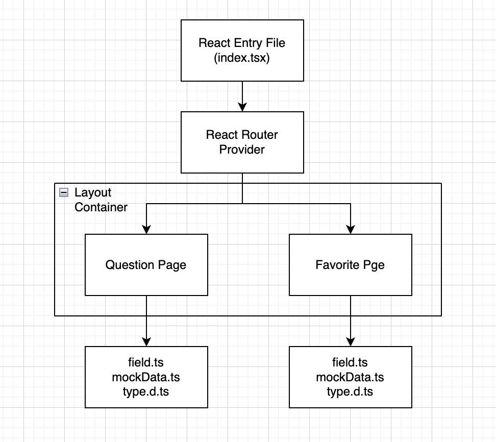

# 项目结构总体设计

# 具体设计

1. Table

- 使用Antd组件库作为UI的基本规范
- 通过对每个页面文件目录的规范，去约束表格配置属性的收敛

2. Filter And Search

- 使用antd Form组件对整个Filter区域进行规范化开发
- 在search和filter时将Search Form的value提交给相应的后端接口

3. Data Format

- 使用JSON格式的数据进行前后端的通信交换
- 前端本地mock的数据格式是满足基本的需求需要
